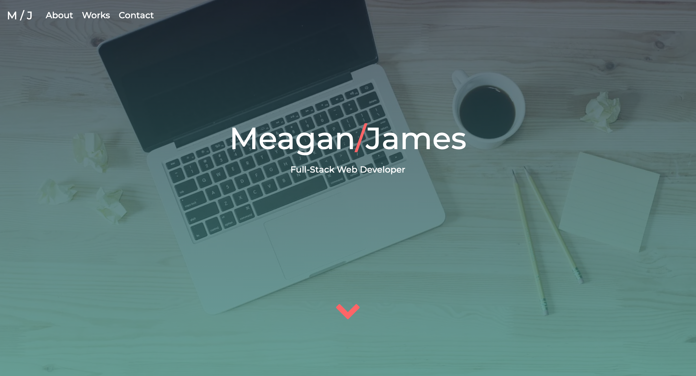

<h1 align="center">Updated Profile</h1>

    
    
   
  
  
  

## Description
An updated portfolio containing most recent works, containing resume and links to my other references.
link to site <a href="https://merikettapearl212.github.io/portfolio2-Dev-Mjames/">here</a>

#### Screenshot of example:

## Questions
:mailbox: Please contact me if you have any questions:
 
  
  
 

#### Powered by :coffee: and  

Thanks for stopping by! :vulcan_salute: